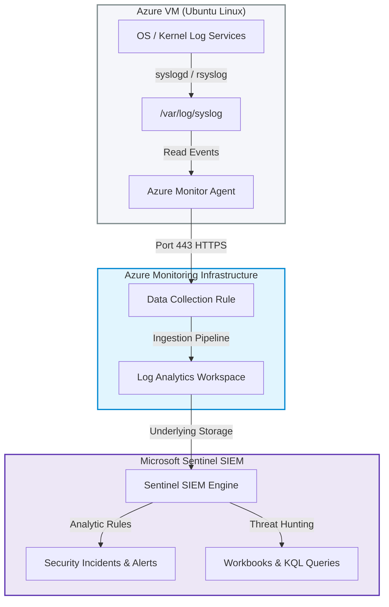

# Lab Architecture & Data Flow

This document details the architecture, component roles, and data flow of the Microsoft Sentinel SIEM Lab.

---

## 🏗️ Architecture Design

---

## ⚙️ Component Description

### 1. Azure Linux VM
- **Role**: Host system generating audit logs, auth logs, kernel logs, and user activity.
- **Operating System**: Ubuntu 24.04 LTS.
- **Log Generator**: Standard `rsyslog` service which routes system event logs locally and exposes them to the Azure Monitor Agent.

### 2. Azure Monitor Agent (AMA)
- **Role**: Replaces the legacy Log Analytics Agent (MMA/OMS).
- **Function**: Runs as a daemon extension on the Linux VM. It reads local log inputs as defined by the associated Data Collection Rule (DCR) and securely uploads them over HTTPS to Azure.
- **Key Advantage**: Uses scoped DCRs to allow filtering at the source, reducing cost and network traffic by avoiding ingestion of unnecessary logs.

### 3. Data Collection Rule (DCR)
- **Role**: Configurations defining data ingestion source, filter rules, and destination.
- **Function**: Specifies which syslog facilities (e.g., `LOG_AUTH`, `LOG_KERN`) and severity levels (e.g., `LOG_ERR`, `LOG_DEBUG`) should be sent to the Log Analytics Workspace.

### 4. Log Analytics Workspace (LAW)
- **Role**: Centralized repository database for all monitoring data.
- **Storage**: Logs are stored in structured tables (e.g., `Syslog`, `Heartbeat`).
- **Query Engine**: Built on Azure Data Explorer, enabling super-fast analysis of millions of records using Kusto Query Language (KQL).

### 5. Microsoft Sentinel
- **Role**: Cloud-native Security Information and Event Management (SIEM) and Security Orchestration Automated Response (SOAR).
- **Function**: Inspects data stored in the Log Analytics Workspace. It applies machine learning, threat intelligence, and analytics rules to detect anomalies, trigger alerts, and orchestrate security incident responses.

---

## 🔄 Data Ingestion Flow

1. **Event Generation**: An event occurs on the Linux VM (e.g., a failed SSH login attempt recorded in `auth.log`).
2. **Local Collection**: The local Syslog daemon captures the event and routes it to system facilities.
3. **Agent Filtering**: The Azure Monitor Agent matches the event facility and severity level against the DCR rules.
4. **Transmission**: The AMA uploads the matching log entry to the Azure Monitor service via TLS 1.2 on TCP port 443.
5. **Storage**: The ingestion pipeline parses the event into JSON columns and commits it to the `Syslog` table inside the Log Analytics Workspace.
6. **Sentinel Evaluation**: Microsoft Sentinel indexes the log entry, matching it against threat detection rules, making it available for live hunting and workbook visualization.
