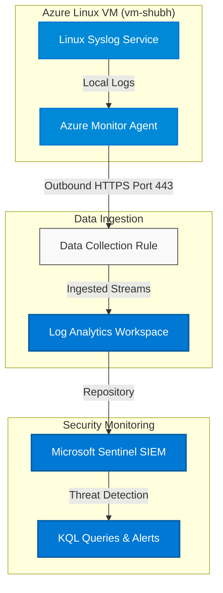

# Microsoft Sentinel SIEM Lab with Azure Linux VM

[](https://azure.microsoft.com/)
[](https://azure.microsoft.com/en-us/products/microsoft-sentinel/)
[](https://learn.microsoft.com/en-us/azure/data-explorer/kusto/query/)
[](LICENSE)

This repository contains the configuration, queries, and documentation for setting up a hands-on **Security Information and Event Management (SIEM)** laboratory. Using Microsoft Sentinel and a Linux Virtual Machine in Microsoft Azure, this lab demonstrates end-to-end security log collection, ingestion, and querying.

---

## Lab Objectives

In this lab, you will learn how to:
- **Provision Azure Infrastructure** (Linux VM, Log Analytics Workspace) using Azure CLI.
- **Enable Microsoft Sentinel** on top of a Log Analytics Workspace.
- **Deploy Azure Monitor Agent (AMA)** to automatically collect security logs from Linux.
- **Create a Data Collection Rule (DCR)** to filter and route Syslog messages.
- **Generate Custom Security Events** using the Linux command line.
- **Run Kusto Query Language (KQL)** queries to analyze heartbeats, login events, and custom syslog logs.

---

## Architecture Overview

The system collects OS-level syslog and security events from the Linux VM, forwards them via the Azure Monitor Agent, parses them through Data Collection Rules, stores them in the Log Analytics Workspace, and analyzes them in Microsoft Sentinel.



For a deeper dive into the infrastructure details, see [docs/Architecture.md](docs/Architecture.md).

---

## Project Structure

```text
Microsoft-Sentinel-SIEM-Lab/
│
├── README.md                          # Main overview and lab steps
│
├── docs/                              # Detailed documentation guides
│   ├── Architecture.md                # System topology and data flow design
│   ├── Setup-Guide.md                 # Complete VM & environment deployment guide
│   └── Sentinel-Configuration.md      # Sentinel & Data Collection Rule (DCR) guide
│
├── queries/                           # Pre-built Kusto Query Language (KQL) scripts
│   ├── heartbeat.kql                  # AMA agent status verification
│   ├── syslog.kql                     # General syslog inspection
│   ├── siem-test.kql                  # Queries for verifying test logs
│   └── auth-logs.kql                  # SSH & user authentication monitoring
│
└── LICENSE                            # MIT License
```

---

## Step-by-Step Lab Setup

### Step 1: Login to Azure
Authenticate your command line with your Azure subscription:
```powershell
az login --use-device-code
```

### Step 2: Create a Resource Group
Create a resource group to contain all the lab resources:
```powershell
az group create \
  --name rg-shubh \
  --location centralindia
```

### Step 3: Create a Log Analytics Workspace
Create the workspace that will act as the data repository:
```powershell
az monitor log-analytics workspace create \
  --resource-group rg-shubh \
  --workspace-name log-shubh \
  --location centralindia
```

### Step 4: Enable Microsoft Sentinel
Enable Sentinel on your Log Analytics Workspace via the Azure Portal:
1. Search for **Microsoft Sentinel** in the Azure Portal search bar.
2. Click **Create** / **Add**.
3. Select the workspace `log-shubh` and click **Add**.

### Step 5: Create Azure Linux VM
Deploy an Ubuntu 24.04 Virtual Machine:
```powershell
az vm create \
  --resource-group rg-shubh \
  --name vm-shubh \
  --image Ubuntu2404 \
  --admin-username azureuser \
  --ssh-key-values C:\Users\USERNAME\.ssh\mujahed.pub
```
> [!NOTE]
> Replace `USERNAME` with your Windows system username, and ensure your public key exists at that path.

### Step 6: Open SSH Port
Open port 22 on the Network Security Group (NSG) to allow inbound SSH:
```powershell
az vm open-port \
  --resource-group rg-shubh \
  --name vm-shubh \
  --port 22
```

### Step 7: Connect to VM
SSH into your newly created virtual machine:
```powershell
ssh -i "C:\Users\USERNAME\.ssh\mujahed.pem" azureuser@PUBLIC-IP
```

### Step 8: Install Azure Monitor Agent (AMA)
In the Azure Portal:
1. Navigate to your virtual machine `vm-shubh`.
2. Under **Settings**, click on **Extensions + Applications**.
3. Click **Add** and select **Azure Monitor Linux Agent**.
4. Click **Create/Install** and wait for the status to show **Succeeded**.

### Step 9: Configure Syslog Connector
In the Azure Portal:
1. Open **Microsoft Sentinel** and select your workspace `log-shubh`.
2. Under **Content Management**, select **Data Connectors**.
3. Search for **Syslog via AMA** and open the connector page.
4. Click on **Create Data Collection Rule**.

### Step 10: Configure Data Collection Rule (DCR)
1. **Rule Name**: `syslog-dcr-shubh`
2. **Resources**: Select your VM `vm-shubh`.
3. **Collect**: Configure the facilities and levels as follows:

| Facility | Minimum Log Level |
|---|---|
| `LOG_AUTH` | `LOG_DEBUG` |
| `LOG_AUTHPRIV` | `LOG_DEBUG` |
| `LOG_DAEMON` | `LOG_DEBUG` |
| `LOG_KERN` | `LOG_DEBUG` |
| `LOG_SYSLOG` | `LOG_DEBUG` |
| `LOG_USER` | `LOG_DEBUG` |

4. Click **Review + Create**.

---

## Testing & Log Ingestion Verification

### 1. Generate Test Logs on VM
Run the following commands inside the SSH session to generate local syslog events:
```bash
logger "SIEM TEST 100"
logger "SIEM TEST 200"
logger "SIEM TEST 300"
```

### 2. Verify Data Ingestion with KQL
In Microsoft Sentinel, open the **Logs** tab and execute these verification queries:

* **Verify Heartbeat** (checks if the AMA agent is communicating):
  ```kusto
  Heartbeat
  | sort by TimeGenerated desc
  | take 10
  ```
  *(See more at [queries/heartbeat.kql](queries/heartbeat.kql))*

* **Verify General Syslog Ingestion**:
  ```kusto
  Syslog
  | take 10
  ```
  *(See more at [queries/syslog.kql](queries/syslog.kql))*

* **Filter Custom Generated Logs**:
  ```kusto
  Syslog
  | where SyslogMessage contains "SIEM TEST"
  | sort by TimeGenerated desc
  ```
  *(See more at [queries/siem-test.kql](queries/siem-test.kql))*

---

## Lab Status Dashboard

| Component | Status | Description |
|---|---|---|
| Azure VM | Active | VM deployed and reachable via SSH |
| SSH Connection | Active | Secure shell access validated |
| Azure Monitor Agent | Running | Agent installed and collecting metrics |
| Log Analytics Workspace | Active | Data storage active and listening |
| Microsoft Sentinel | Enabled | Threat detection dashboard active |
| Data Collection Rule | Configured | DCR routes Syslog messages to workspace |
| Heartbeat Logs | Ingesting | VM agent health reports successfully ingested |
| Syslog Logs | Ingesting | OS level Syslog streaming functional |
| SIEM Test Logs | Verified | Custom test strings queryable via KQL |

---

## License
This project is licensed under the MIT License - see the [LICENSE](LICENSE) file for details.
